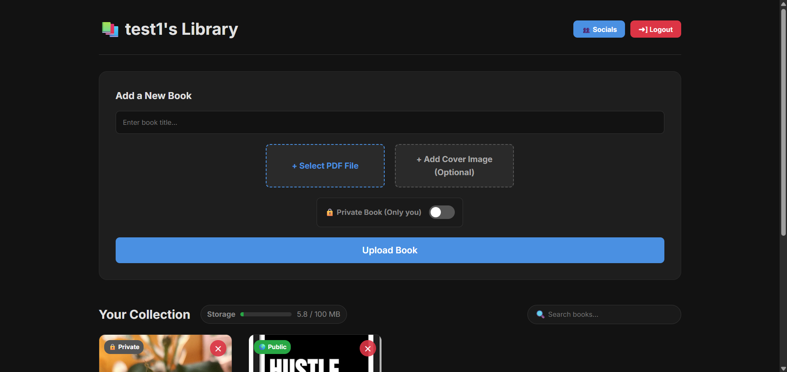
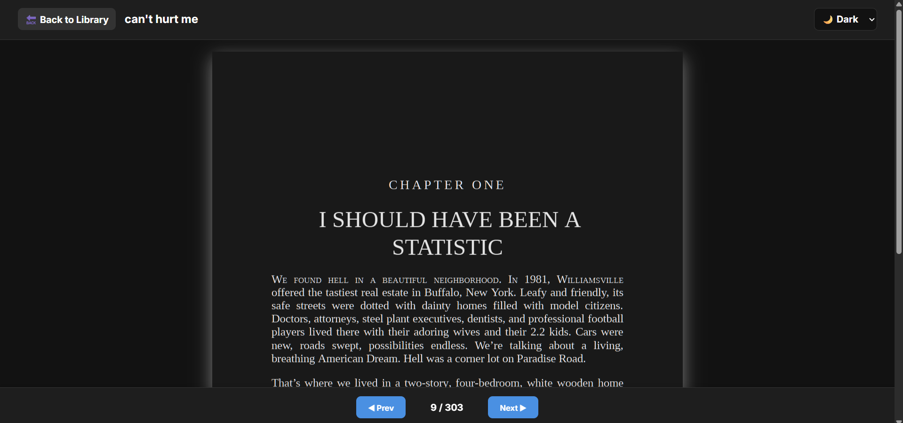
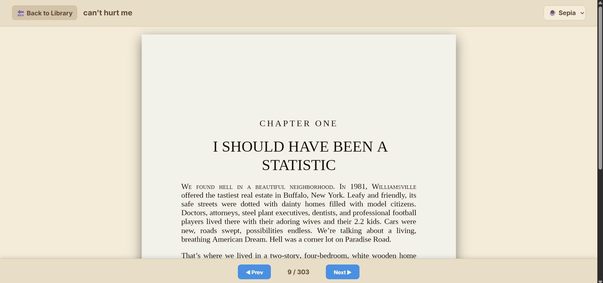
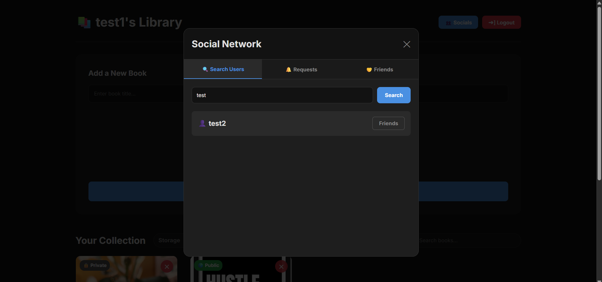

# 📚 YourBooks --- Cloud-Native E-Reader Platform


🌐 **Live Application:** https://yourbooks.space

YourBooks is a scalable, cloud-native e-reader and digital library
platform built using the MERN stack.\
It enables users to upload, manage, and read PDF documents securely
across devices while maintaining synchronized reading progress and
offering social sharing capabilities.

Designed with performance, scalability, and clean architecture in mind,
the application separates file storage from structured data to ensure
efficient cloud deployment.

------------------------------------------------------------------------

## ✨ Core Highlights

### ☁️ Cloud-Based File Architecture

-   Secure PDF and image uploads using AWS S3\
-   `multer-s3` integration for direct cloud storage\
-   Reduces MongoDB load by separating file storage from metadata

### 📖 Seamless Reading Experience

-   Persistent page tracking stored in MongoDB\
-   Resume reading instantly across devices\
-   Built with `react-pdf` for optimized document rendering

### 📱 Mobile-First Design

-   Fully responsive reader layout\
-   Dynamic PDF scaling\
-   Theme customization (Dark, Light, Sepia)\
-   Sticky mobile navigation for smooth usability

### 👥 Social Library System

-   Friend search and request functionality\
-   Public library sharing\
-   Isolated guest reading progress (stored locally in browser)

### 🔐 Secure Authentication

-   JWT-based authentication\
-   Password hashing using bcrypt\
-   Protected REST API routes

------------------------------------------------------------------------

## 🏗 System Architecture Overview

Frontend (Vercel)\
↓\
Backend API (Render)\
↓\
MongoDB Atlas (User & Metadata)\
↓\
AWS S3 (File Storage)

This separation ensures scalability, security, and efficient resource
utilization.

------------------------------------------------------------------------

## 🛠 Technology Stack

### Frontend

-   React.js (Vite)\
-   React Router DOM\
-   React-PDF\
-   Hosted on Vercel

### Backend

-   Node.js\
-   Express.js\
-   MongoDB Atlas (Mongoose ODM)\
-   AWS SDK (S3 Integration)\
-   JWT & Bcrypt Authentication\
-   Hosted on Render

------------------------------------------------------------------------

## 🚀 Getting Started Locally

### 1️⃣ Clone Repositories

``` bash
git clone https://github.com/pratapsur/yourbooks-backend.git
git clone https://github.com/pratapsur/yourbooks-frontend.git
```

------------------------------------------------------------------------

### 2️⃣ Backend Setup

``` bash
cd yourbooks-backend
npm install
```

Create a `.env` file in the backend root:

    MONGO_URI=your_mongodb_connection_string
    JWT_SECRET=your_secret_key
    AWS_ACCESS_KEY_ID=your_key
    AWS_SECRET_ACCESS_KEY=your_secret
    AWS_REGION=your_region
    AWS_BUCKET_NAME=your_bucket_name

Start backend server:

``` bash
npm start
```

------------------------------------------------------------------------

### 3️⃣ Frontend Setup

``` bash
cd ../yourbooks-frontend
npm install
npm run dev
```

------------------------------------------------------------------------

## 📸 Application Preview


  


------------------------------------------------------------------------

## 📦 Deployment Stack

-   Frontend → Vercel\
-   Backend → Render\
-   Database → MongoDB Atlas\
-   File Storage → AWS S3

------------------------------------------------------------------------

## 🔮 Planned Enhancements

-   EPUB file support\
-   Text highlighting & annotations\
-   Offline PWA mode\
-   Real-time collaborative reading\
-   Book recommendations system

------------------------------------------------------------------------

## 👨‍💻 Author

**Pratap Suryavanshi**\
Electronics & Computer Engineering Student\
Full-Stack Developer \| Cloud Enthusiast

------------------------------------------------------------------------

⭐ If you found this project interesting, consider giving it a star!
